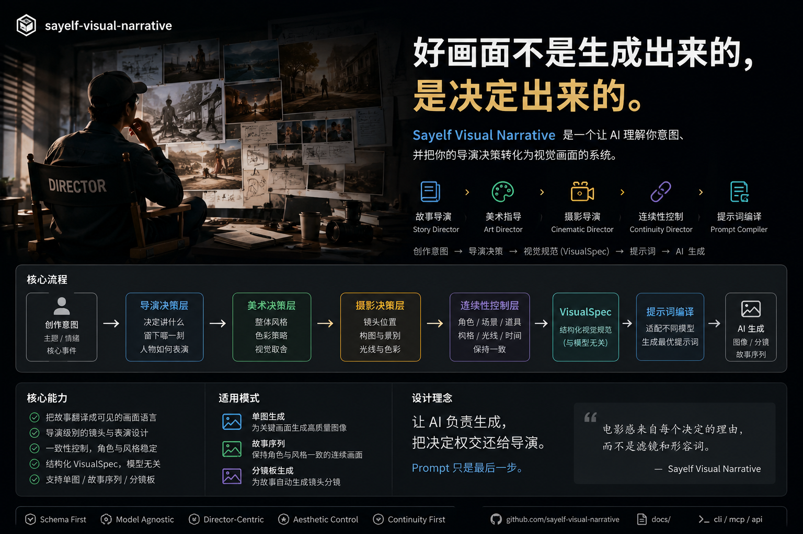

# sayelf-visual-narrative



> **好画面不是生成出来的，是决定出来的。**

Sayelf Visual Narrative 是一个模型无关的 AI 视觉导演 Skill。当前新增的产品定义是：

> **一句话 → 自动选择视觉叙事 Skill → 同源图片关键帧 + 视频分镜。**

## Dual Output Contract v1.0

每个视觉叙事 Skill 返回一个统一对象：

- `narrative_core`：主题、情绪、世界、生命主体、关系、决定性瞬间和余韵的唯一来源；
- `image_prompt`：最值得停下来的图片关键帧；
- `video_storyboard`：进入并离开这个关键帧的连续视频分镜。

两个输出必须携带同一个 `narrative_core_id`。本地运行时还会校验 manifest、JSON Schema、镜头顺序和总时长。

## Core 与插件边界

Core 只做四件事：发现 Skill、路由一句话意图、执行被选中的插件、验证 manifest 和双输出结果。视觉领域智能属于插件；构图、材质、镜头、情绪节奏和提示词内容不写进 Core。

## 已注册 Skill

- `life-comes-closer` / `自然靠近你`：人与自然安静相遇。
- `visual-storytelling` / `视觉叙事`：高纯度、低刺激、留白的视觉叙事。

新增视觉风格只需新增 manifest 和插件，不需要修改 Core。

## 本地运行

```bash
npm test
npm run test:dual-output
```

运行时不依赖网络，不包含 API key，也不会上传输入或输出。现有 VisualSpec、质量门、连续性检查和 provider 适配器保持不变。

本次版本不构建 Marketplace、账号体系、云模型调用、媒体生成或新的 WebUI。
